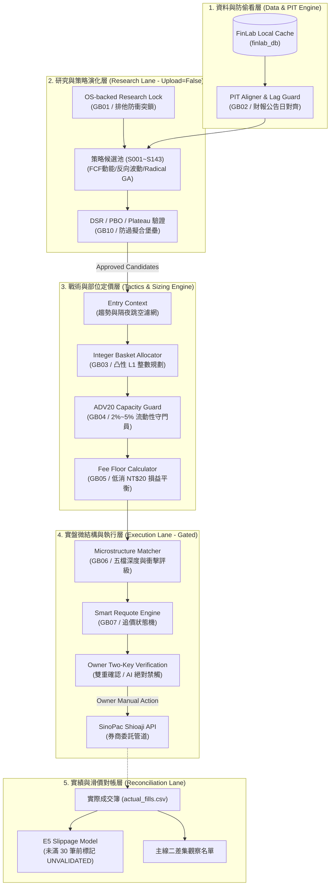

# 全系統架構地圖與資料流向導 (System Map)

## 一句話總結 (TL;DR)

Quant Grill Lab 是一套貫徹「**研究、模擬、實盤三層物理隔離**」的台股工程級量化工作台。系統從資料端嚴格對齊 PIT，經過戰術整數分配與 ADV20 容量過濾，再交由微結構引擎產生限價訂單，並由獨立的對帳線進行滑價校準。

---

## 1. 全系統三層物理隔離架構圖

---

## 2. 各層核心職責與積木對應表

| 層級 | 核心職責 | 關鍵輸入 | 關鍵輸出 | 對應積木 |
|---|---|---|---|---|
| **1. 資料層** | PIT 財報發布日對齊、營收公佈日遞延、全域資料隔離 | FinLab Raw DB | 防偷看的 Clean Dataframe | `GB02` |
| **2. 研究層** | 候選策略生成、反向波動加權、多因子 GA 搜尋、DSR 去膨脹 | Clean Data | 策略訊號與通過 DSR 門檻之候選池 | `GB01`, `GB08`, `GB09`, `GB10` |
| **3. 戰術層** | 帳戶真實可用現金轉換為整數張數/零股、ADV20 流動性檢查、手續費低消過濾 | 策略權重 + 帳戶現金 | 具體每檔欲買進之整數股數 (Notional) | `GB03`, `GB04`, `GB05` |
| **4. 執行層** | 五檔盤口微結構判定、TWAP/VWAP 拆單、限價智慧追價狀態機 | 即時報價 + 整數委託意圖 | 格式化之券商下單合約（待 Owner 手動確認） | `GB06`, `GB07` |
| **5. 對帳層** | 券商成交回報匯入、先進先出 (FIFO) 實踐損益計算、E5 滑價模型校準 | 券商成交明細 CSV | 實踐報酬率、真實滑價分佈、主線二名單 | `Claude C00`, `B01` |

---

## 3. NotebookLM 快速導引

- **提問範本 1**：「請根據 System Map 說明，一筆策略訊號從產生到最終被送往券商，中間經過了哪五道風控關卡？」
- **提問範本 2**：「為什麼 Quant Grill Lab 堅持在第 4 層加入 Owner Two-Key Verification，而不讓 AI 全自動送單？」
