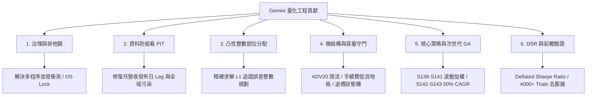

# Gemini 全景脈絡 · 拆解黑盒子與工程級量化哲學

## 一句話總結 (TL;DR)

本文件是 **Gemini (Google DeepMind / Antigravity)** 在 Quant Grill Lab 系統中的主脈絡導覽。我們將原本晦澀的量化「黑盒子」徹底拆解為具備清晰數學定義、純函數實作與單元測試的 **10 大獨立積木（Building Blocks）**，並確立「研究不碰實盤、無摩擦不代表真收益、防過擬合高於漂亮回測」的工程量化哲學。

---

## 1. 為什麼要重整整個系統？

當散戶或初階量化工程師踏入台股量化時，最常陷入以下「**三大黑盒子幻覺**」：

```
                    【量化初學者的三大致命幻覺】
┌─────────────────────────────────────────────────────────────┐
│ 1. 回測幻覺 ── 忽視月營收在10號才公佈，回測在1號就偷看成交      │
│ 2. 資金幻覺 ── 數學上的 5% 權重，在實盤帳戶連 1 張股票都買不起  │
│ 3. 滑價幻覺 ── 假設掛單就能在次日開盤價全部成交，忽略深度衝擊  │
└─────────────────────────────────────────────────────────────┘
```

本專案經過 Opus、Codex、Claude 與 Gemini 的多代演化，我們在 Gemini 這一階段的核心任務就是：
**「把所有的模糊假設全部程式化、合約化，將龐大系統拆成可自由組裝的積木，並讓任何 AI 都能在 3 分鐘內看懂全貌。」**

---

## 2. Gemini 在系統中完成了什麼？（六大核心領域）



### 1. 基礎設施與治理 (Governance & Research Lock)
- **問題**：多個 AI 或批次回測同時執行時，爭奪資料庫與網站生成資源，造成回測中斷與狀態污染。
- **解決方案**：實作全域 OS-backed `RESEARCH_LOCK.json`，提供 `OFFICIAL_SIM`、`REGISTRY_WRITE`、`SITE_BUILD` 三種互斥鎖與逾時自動回收機制（見 [G01](01-governance-and-fail-closed.md) 及 [GB01](blocks/GB01-research-lock.md)）。

### 2. 資料管線與防偷看防禦 (Data & PIT Safe)
- **問題**：月營收與季報的「時間標籤」容易被誤當作「發布日」（Lookahead Bias），且 `data.set_universe()` 會污染全域進程。
- **解決方案**：建立嚴格的 PIT 對齊器與 Lag 守衛，強制所有財報與營收訊號遞延至法定公告日次日（見 [G02](02-data-pit-and-leakage-defense.md) 及 [GB02](blocks/GB02-pit-lag-aligner.md)）。

### 3. 進出場戰術與整數部位分配 (Tactics & Integer Sizing)
- **問題**：策略產出連續權重（如 3.2%），但在真實帳戶只有 NT$50 萬時，高價股買不起整張，隨便四捨五入會完全摧毀策略原本的多因子結構。
- **解決方案**：提出**凸性 L1 追蹤誤差整數規劃演算法（Pareto Frontier Sweep）**，在現金預算與單檔上限約束下，求解出最貼近策略理想權重的整數張數與零股配置（見 [G03](03-tactics-and-integer-sizing.md) 及 [GB03](blocks/GB03-integer-basket-allocator.md)）。

### 4. 微結構與執行工程 (Microstructure & Capacity)
- **問題**：高 Sharpe 策略常偷偷買入無成交量的「殭屍股」，實盤根本無法承載百萬資金。
- **解決方案**：建立 **ADV20 容量守門員（單檔限制 ≤ 2%~5% ADV）**、**手續費低消地板（NT$20 門檻檢查）**、**五檔盤口衝擊評級** 與 **限價智慧追價狀態機**（見 [G04](04-microstructure-and-execution.md) 及 [GB04](blocks/GB04-adv-capacity-guard.md)~[GB07](blocks/GB07-smart-requote-engine.md)）。

### 5. 核心策略演化與 GA 藍圖 (Alpha Strategies & Radical GA)
- **問題**：等權重與單一月調倉使策略受限於 CAGR 25% 的均值回歸天花板。
- **解決方案**：
  - 開發 **Gemini 001~007 策略家族（S138~S141）**：導入反向波動度加權（Inverse Volatility Sizing）、波動度目標控管與多方法論集成。
  - 提出 **次世代 50% CAGR 遺傳演算法（GA）藍圖（S142~S143）**：採用 8~12 檔帕雷托集中持股與雙軌混合進出場機制（見 [G05](05-alpha-strategies-and-ga.md) 及 [GB08](blocks/GB08-volatility-target-sizer.md)~[GB09](blocks/GB09-fcf-momentum-core.md)）。

### 6. 嚴格防過擬合與前瞻驗證 (Validation & Forward SIM)
- **問題**：跑了數千次試驗後挑出的最佳策略，極可能只是隨機噪聲。
- **解決方案**：導入 **Deflated Sharpe Ratio (DSR)** 與 **PBO**，強制將 4,000+ 次試驗納入分母進行顯著性折價懲罰；並建立不可回填的 **Forward SIM 追蹤鏈**（見 [G06](06-validation-dsr-and-forward-sim.md) 及 [GB10](blocks/GB10-dsr-pbo-validator.md)）。

---

## 3. 10 大獨立黑盒子積木（Building Blocks）索引

每個積木均為無狀態或自包含模組，附帶完整單元測試，可直接在其他專案中引用：

| 編號 | 積木名稱 | 核心功能 | 原始代碼位置 |
|---|---|---|---|
| [`GB01`](blocks/GB01-research-lock.md) | **全域排他研究鎖** | 多程序並發安全防衝突、心跳逾時自動回收 | `scripts/research_lock.py` |
| [`GB02`](blocks/GB02-pit-lag-aligner.md) | **PIT 財報營收對齊器** | 嚴格依照法定公告日對齊，根除偷看未來資料 | `src/quant_grill_lab/strategies/claude_core.py` |
| [`GB03`](blocks/GB03-integer-basket-allocator.md) | **凸性整數規劃分配器** | 給定預算與權重，精確求解最佳整數股數組合 | `src/quant_grill_lab/tactics/allocation.py` |
| [`GB04`](blocks/GB04-adv-capacity-guard.md) | **ADV20 容量守門員** | 檢查單檔委託是否超過 20 日均量 2%~5% | `src/quant_grill_lab/execution/capacity_guard.py` |
| [`GB05`](blocks/GB05-fee-floor-calculator.md) | **手續費低消計算器** | 評估小額委託手續費佔比，過濾被低消吃掉的標的 | `src/quant_grill_lab/execution/fee_floor.py` |
| [`GB06`](blocks/GB06-microstructure-matcher.md) | **五檔微結構評級器** | 根據買賣五檔深度與 Spread 判定最佳掛單方式 | `src/quant_grill_lab/execution/strategy_microstructure_matcher.py` |
| [`GB07`](blocks/GB07-smart-requote-engine.md) | **限價智慧追價狀態機** | 委託未成交時的超時重報、滑價保護與撤單狀態機 | `src/quant_grill_lab/execution/requote.py` |
| [`GB08`](blocks/GB08-volatility-target-sizer.md) | **波動度目標部位調節器** | 依近期市場與個股波動動態縮放持股水位 | `src/quant_grill_lab/strategies/gemini_004_vol_target_cashflow_momentum.py` |
| [`GB09`](blocks/GB09-fcf-momentum-core.md) | **現金流營收動能因子核心** | 結合營運現金流、營業毛利與動能的選股核心 | `src/quant_grill_lab/strategies/gemini_001_weighted_cashflow_momentum.py` |
| [`GB10`](blocks/GB10-dsr-pbo-validator.md) | **DSR / PBO 過擬合檢驗器** | 納入多重試驗次數懲罰的統計顯著性檢驗 | `src/quant_grill_lab/strategy_selection/` |

---

## 4. 如何在 NotebookLM 與各家 AI 中使用本教材？

1. **整體架構速讀**：將本篇 [G00](00-gemini-master-context.md) 與 [_shared/SYSTEM_MAP.md](../_shared/SYSTEM_MAP.md) 匯入 NotebookLM，詢問：
   > 「請用大白話解釋 Quant Grill Lab 如何將『策略研究』與『實盤下單』進行物理隔離？」
2. **黑盒子積木拼裝**：將 [GB03](blocks/GB03-integer-basket-allocator.md) 與 [GB04](blocks/GB04-adv-capacity-guard.md) 匯入 ChatGPT 或 Claude，詢問：
   > 「我有一筆 100 萬資金與 10 檔股票目標權重，請用 GB03 與 GB04 幫我寫出計算真實下單張數的 Python 腳本。」
3. **跨 AI 交互學習**：將 Claude 專區的 [C00](../claude/00-context.md) 與本篇 [G00](00-gemini-master-context.md) 同時提供給 AI，詢問：
   > 「Claude 的『實績對帳主線』與 Gemini 的『戰術整數分配』如何協同運作？」
