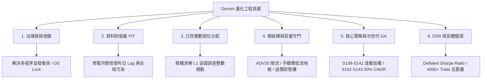

# lesson/gemini · 完整合輯

作者 AI：**Gemini (Google DeepMind / Antigravity)**　·　檔案 17 份　·　產生於 2026-09-08

這份檔案把整個目錄串成一份，給只能吃一個 URL 的 AI 用。
每一節開頭的 `## [id] title` 對應一個獨立檔案，可以單獨抽走使用。

---

## [G00] Gemini 全景脈絡 · 拆解黑盒子與工程級量化哲學

*track: context · status: unvalidated · source: lesson/gemini/00-gemini-master-context.md*

# Gemini 全景脈絡 · 拆解黑盒子與工程級量化哲學

## 一句話總結 (TL;DR)

本文件是 **Gemini (Google DeepMind / Antigravity)** 在 Quant Grill Lab 系統中的主脈絡導覽。我們將原本晦澀的量化「黑盒子」徹底拆解為具備清晰數學定義、純函數實作與單元測試的 **10 大獨立積木（Building Blocks）**，並確立「研究不碰實盤、無摩擦不代表真收益、防過擬合高於漂亮回測」的工程量化哲學。

---

## 1. 為什麼要重整整個系統？

當散戶或初階量化工程師踏入台股量化時，最常陷入以下「**三大黑盒子幻覺**」：

```
                    【量化初學者的三大致命幻覺】
┌─────────────────────────────────────────────────────────────┐
│ 1. 回測幻覺 ── 忽視月營收在10號才公佈，回測在1號就偷看成交      │
│ 2. 資金幻覺 ── 數學上的 5% 權重，在實盤帳戶連 1 張股票都買不起  │
│ 3. 滑價幻覺 ── 假設掛單就能在次日開盤價全部成交，忽略深度衝擊  │
└─────────────────────────────────────────────────────────────┘
```

本專案經過 Opus、Codex、Claude 與 Gemini 的多代演化，我們在 Gemini 這一階段的核心任務就是：
**「把所有的模糊假設全部程式化、合約化，將龐大系統拆成可自由組裝的積木，並讓任何 AI 都能在 3 分鐘內看懂全貌。」**

---

## 2. Gemini 在系統中完成了什麼？（六大核心領域）



### 1. 基礎設施與治理 (Governance & Research Lock)
- **問題**：多個 AI 或批次回測同時執行時，爭奪資料庫與網站生成資源，造成回測中斷與狀態污染。
- **解決方案**：實作全域 OS-backed `RESEARCH_LOCK.json`，提供 `OFFICIAL_SIM`、`REGISTRY_WRITE`、`SITE_BUILD` 三種互斥鎖與逾時自動回收機制（見 [G01](https://raw.githubusercontent.com/wegoliao/Quant/main/lesson/gemini/01-governance-and-fail-closed.md) 及 [GB01](https://raw.githubusercontent.com/wegoliao/Quant/main/lesson/gemini/blocks/GB01-research-lock.md)）。

### 2. 資料管線與防偷看防禦 (Data & PIT Safe)
- **問題**：月營收與季報的「時間標籤」容易被誤當作「發布日」（Lookahead Bias），且 `data.set_universe()` 會污染全域進程。
- **解決方案**：建立嚴格的 PIT 對齊器與 Lag 守衛，強制所有財報與營收訊號遞延至法定公告日次日（見 [G02](https://raw.githubusercontent.com/wegoliao/Quant/main/lesson/gemini/02-data-pit-and-leakage-defense.md) 及 [GB02](https://raw.githubusercontent.com/wegoliao/Quant/main/lesson/gemini/blocks/GB02-pit-lag-aligner.md)）。

### 3. 進出場戰術與整數部位分配 (Tactics & Integer Sizing)
- **問題**：策略產出連續權重（如 3.2%），但在真實帳戶只有 NT$50 萬時，高價股買不起整張，隨便四捨五入會完全摧毀策略原本的多因子結構。
- **解決方案**：提出**凸性 L1 追蹤誤差整數規劃演算法（Pareto Frontier Sweep）**，在現金預算與單檔上限約束下，求解出最貼近策略理想權重的整數張數與零股配置（見 [G03](https://raw.githubusercontent.com/wegoliao/Quant/main/lesson/gemini/03-tactics-and-integer-sizing.md) 及 [GB03](https://raw.githubusercontent.com/wegoliao/Quant/main/lesson/gemini/blocks/GB03-integer-basket-allocator.md)）。

### 4. 微結構與執行工程 (Microstructure & Capacity)
- **問題**：高 Sharpe 策略常偷偷買入無成交量的「殭屍股」，實盤根本無法承載百萬資金。
- **解決方案**：建立 **ADV20 容量守門員（單檔限制 ≤ 2%~5% ADV）**、**手續費低消地板（NT$20 門檻檢查）**、**五檔盤口衝擊評級** 與 **限價智慧追價狀態機**（見 [G04](https://raw.githubusercontent.com/wegoliao/Quant/main/lesson/gemini/04-microstructure-and-execution.md) 及 [GB04](https://raw.githubusercontent.com/wegoliao/Quant/main/lesson/gemini/blocks/GB04-adv-capacity-guard.md)~[GB07](https://raw.githubusercontent.com/wegoliao/Quant/main/lesson/gemini/blocks/GB07-smart-requote-engine.md)）。

### 5. 核心策略演化與 GA 藍圖 (Alpha Strategies & Radical GA)
- **問題**：等權重與單一月調倉使策略受限於 CAGR 25% 的均值回歸天花板。
- **解決方案**：
  - 開發 **Gemini 001~007 策略家族（S138~S141）**：導入反向波動度加權（Inverse Volatility Sizing）、波動度目標控管與多方法論集成。
  - 提出 **次世代 50% CAGR 遺傳演算法（GA）藍圖（S142~S143）**：採用 8~12 檔帕雷托集中持股與雙軌混合進出場機制（見 [G05](https://raw.githubusercontent.com/wegoliao/Quant/main/lesson/gemini/05-alpha-strategies-and-ga.md) 及 [GB08](https://raw.githubusercontent.com/wegoliao/Quant/main/lesson/gemini/blocks/GB08-volatility-target-sizer.md)~[GB09](https://raw.githubusercontent.com/wegoliao/Quant/main/lesson/gemini/blocks/GB09-fcf-momentum-core.md)）。

### 6. 嚴格防過擬合與前瞻驗證 (Validation & Forward SIM)
- **問題**：跑了數千次試驗後挑出的最佳策略，極可能只是隨機噪聲。
- **解決方案**：導入 **Deflated Sharpe Ratio (DSR)** 與 **PBO**，強制將 4,000+ 次試驗納入分母進行顯著性折價懲罰；並建立不可回填的 **Forward SIM 追蹤鏈**（見 [G06](https://raw.githubusercontent.com/wegoliao/Quant/main/lesson/gemini/06-validation-dsr-and-forward-sim.md) 及 [GB10](https://raw.githubusercontent.com/wegoliao/Quant/main/lesson/gemini/blocks/GB10-dsr-pbo-validator.md)）。

---

## 3. 10 大獨立黑盒子積木（Building Blocks）索引

每個積木均為無狀態或自包含模組，附帶完整單元測試，可直接在其他專案中引用：

| 編號 | 積木名稱 | 核心功能 | 原始代碼位置 |
|---|---|---|---|
| [`GB01`](https://raw.githubusercontent.com/wegoliao/Quant/main/lesson/gemini/blocks/GB01-research-lock.md) | **全域排他研究鎖** | 多程序並發安全防衝突、心跳逾時自動回收 | `scripts/research_lock.py` |
| [`GB02`](https://raw.githubusercontent.com/wegoliao/Quant/main/lesson/gemini/blocks/GB02-pit-lag-aligner.md) | **PIT 財報營收對齊器** | 嚴格依照法定公告日對齊，根除偷看未來資料 | `src/quant_grill_lab/strategies/claude_core.py` |
| [`GB03`](https://raw.githubusercontent.com/wegoliao/Quant/main/lesson/gemini/blocks/GB03-integer-basket-allocator.md) | **凸性整數規劃分配器** | 給定預算與權重，精確求解最佳整數股數組合 | `src/quant_grill_lab/tactics/allocation.py` |
| [`GB04`](https://raw.githubusercontent.com/wegoliao/Quant/main/lesson/gemini/blocks/GB04-adv-capacity-guard.md) | **ADV20 容量守門員** | 檢查單檔委託是否超過 20 日均量 2%~5% | `src/quant_grill_lab/execution/capacity_guard.py` |
| [`GB05`](https://raw.githubusercontent.com/wegoliao/Quant/main/lesson/gemini/blocks/GB05-fee-floor-calculator.md) | **手續費低消計算器** | 評估小額委託手續費佔比，過濾被低消吃掉的標的 | `src/quant_grill_lab/execution/fee_floor.py` |
| [`GB06`](https://raw.githubusercontent.com/wegoliao/Quant/main/lesson/gemini/blocks/GB06-microstructure-matcher.md) | **五檔微結構評級器** | 根據買賣五檔深度與 Spread 判定最佳掛單方式 | `src/quant_grill_lab/execution/strategy_microstructure_matcher.py` |
| [`GB07`](https://raw.githubusercontent.com/wegoliao/Quant/main/lesson/gemini/blocks/GB07-smart-requote-engine.md) | **限價智慧追價狀態機** | 委託未成交時的超時重報、滑價保護與撤單狀態機 | `src/quant_grill_lab/execution/requote.py` |
| [`GB08`](https://raw.githubusercontent.com/wegoliao/Quant/main/lesson/gemini/blocks/GB08-volatility-target-sizer.md) | **波動度目標部位調節器** | 依近期市場與個股波動動態縮放持股水位 | `src/quant_grill_lab/strategies/gemini_004_vol_target_cashflow_momentum.py` |
| [`GB09`](https://raw.githubusercontent.com/wegoliao/Quant/main/lesson/gemini/blocks/GB09-fcf-momentum-core.md) | **現金流營收動能因子核心** | 結合營運現金流、營業毛利與動能的選股核心 | `src/quant_grill_lab/strategies/gemini_001_weighted_cashflow_momentum.py` |
| [`GB10`](https://raw.githubusercontent.com/wegoliao/Quant/main/lesson/gemini/blocks/GB10-dsr-pbo-validator.md) | **DSR / PBO 過擬合檢驗器** | 納入多重試驗次數懲罰的統計顯著性檢驗 | `src/quant_grill_lab/strategy_selection/` |

---

## 4. 如何在 NotebookLM 與各家 AI 中使用本教材？

1. **整體架構速讀**：將本篇 [G00](https://raw.githubusercontent.com/wegoliao/Quant/main/lesson/gemini/00-gemini-master-context.md) 與 [_shared/SYSTEM_MAP.md](https://raw.githubusercontent.com/wegoliao/Quant/main/lesson/_shared/SYSTEM_MAP.md) 匯入 NotebookLM，詢問：
   > 「請用大白話解釋 Quant Grill Lab 如何將『策略研究』與『實盤下單』進行物理隔離？」
2. **黑盒子積木拼裝**：將 [GB03](https://raw.githubusercontent.com/wegoliao/Quant/main/lesson/gemini/blocks/GB03-integer-basket-allocator.md) 與 [GB04](https://raw.githubusercontent.com/wegoliao/Quant/main/lesson/gemini/blocks/GB04-adv-capacity-guard.md) 匯入 ChatGPT 或 Claude，詢問：
   > 「我有一筆 100 萬資金與 10 檔股票目標權重，請用 GB03 與 GB04 幫我寫出計算真實下單張數的 Python 腳本。」
3. **跨 AI 交互學習**：將 Claude 專區的 [C00](https://raw.githubusercontent.com/wegoliao/Quant/main/lesson/claude/00-context.md) 與本篇 [G00](https://raw.githubusercontent.com/wegoliao/Quant/main/lesson/gemini/00-gemini-master-context.md) 同時提供給 AI，詢問：
   > 「Claude 的『實績對帳主線』與 Gemini 的『戰術整數分配』如何協同運作？」

---

## [G01] 治理邊界、排他研究鎖與 Fail-Closed 防禦架構

*track: governance · status: unvalidated · source: lesson/gemini/01-governance-and-fail-closed.md*

# 治理邊界、排他研究鎖與 Fail-Closed 防禦架構

## 一句話總結 (TL;DR)

在多 Agent、多腳本並發的量化環境中，任何未加鎖的寫入都會導致回測數據污染或網站生成崩潰；而在交易執行路徑上，任何不確定的狀態都必須**防禦性關閉（Fail-Closed）**。本章闡述全域排他鎖 `RESEARCH_LOCK.json` 的設計與三層物理隔離治理鐵律。

---

## 1. 為什麼需要全域排他研究鎖？

在過去的探索中（如 Codex G070~G075 階段），曾發生過數次重大事故：
- **並發寫入衝突**：一個 Agent 正在執行 81 支策略的全量回測，另一個 Agent 同時向 `registry` 寫入新策略，導致正在產出的指標快照與策略清單不一致，整站重建被 fail-closed 終止，浪費數十分鐘運算。
- **孤兒鎖死鎖**：某些回測腳本因例外崩潰退出，留下了未釋放的鎖，導致後續所有研究流程全部卡死。

### 解決方案：OS 級全域研究鎖 (`RESEARCH_LOCK.json`)

```
                          【全域研究鎖運作狀態機】
                              ┌─────────────┐
                              │    IDLE     │
                              └──────┬──────┘
                   acquire_lock()    │  檢查心跳 < 15 分鐘
                                     ▼
        ┌────────────────────────────────────────────────────────┐
        │  鎖定狀態 (OFFICIAL_SIM / REGISTRY_WRITE / SITE_BUILD) │
        │  記錄: pid, holder, acquired_at, heartbeat_at, scope   │
        └────────────────────────────┬───────────────────────────┘
                 release_lock()      │  崩潰或逾時 > 15 分鐘
                                     ▼
                              ┌─────────────┐
                              │ 釋放 / 回收  │
                              └─────────────┘
```

鎖包含三種互斥類型：
1. `OFFICIAL_SIM`：執行官方基準回測時鎖定，防止策略代碼被篡改。
2. `REGISTRY_WRITE`：註冊新策略或修改參數時鎖定，防止回測讀到半成品。
3. `SITE_BUILD`：編譯生成首頁與報表時鎖定，確保讀取一致的快照。

---

## 2. 治理邊界三大鐵律 (Three Hard Boundaries)

### 鐵律一：Research / SIM / Execution 嚴格隔離
- **研究層 (Research Lane)**：`upload=False`，使用本機 `finlab_db`，不載入券商 SDK，無權限讀取帳戶與憑證。
- **券商模組隔離**：`shioaji` **只能在 `src/quant_grill_lab/execution/` 中被引用**，任何在策略、研究或筆記本中引用券商 SDK 的行為均被 CI 自動阻擋。

### 鐵律二：AI 絕對無權下單 (No Autonomous Real Orders)
- 自然語言輸出的 AI 永遠不具備傳送真實訂單的授權。
- 下單腳本必須具備 **Owner 雙重手動確認（Two-Key Verification）**，包含指紋校驗（Fingerprint）與短效一次性授權（Single-Use Auth）。AI 只能產出訂單意圖（Order Proposal），按下發送按鈕永遠是人類的事。

### 鐵律三：防禦性關閉 (Fail-Closed)
- 當遇見 `UNKNOWN`、`PENDING`、`PARTIAL_FILL` 或資料缺失時，系統**絕對不自動猜測或重試**，而是立即停止操作並通知人類，避免在異常盤口中重複送單導致巨額虧損。

---

## 3. 核心積木與代碼實作

完整獨立可運行的研究鎖實作請參閱 [`GB01 全域排他研究鎖`](https://raw.githubusercontent.com/wegoliao/Quant/main/lesson/gemini/blocks/GB01-research-lock.md)。

### 常用命令列操作：
```powershell
# 1. 查詢當前研究鎖狀態
.\.venv\Scripts\python.exe scripts\research_lock.py status

# 2. 在鎖保護下安全執行官方回測
.\.venv\Scripts\python.exe scripts\research_lock.py run `
  --kind OFFICIAL_SIM --holder "Gemini" --scope "S138-S141 Verification" -- `
  pytest tests/test_strategy_signals_gate.py
```

---

## 4. NotebookLM & AI 提問範本

- **提問範本 1**：「請總結為什麼本系統堅持禁止 AI 自主向券商 API 送單？背後的風險模型是什麼？」
- **提問範本 2**：「如果一個回測腳本在持有 `OFFICIAL_SIM` 鎖時意外被中斷，系統是如何透過心跳機制（Heartbeat）避免死鎖的？」

---

## [G02] 資料防偷看防禦 · FinLab 資料管線與 PIT 財報公告日對齊

*track: data · status: unvalidated · source: lesson/gemini/02-data-pit-and-leakage-defense.md*

# 資料防偷看防禦 · FinLab 資料管線與 PIT 財報公告日對齊

## 一句話總結 (TL;DR)

台股量化回測中最常見的「假聖杯」，90% 來自於**把未公開的資料當成已公開（Lookahead Bias）**。本章深度剖析月營收與季報的法定公告日延遲（Lag）、FinLab 中 `set_universe` 的全域進程污染陷阱，以及如何建構精確的 Point-in-Time (PIT) 防禦機制。

---

## 1. 致命陷阱一：月營收與季報的「時間標籤」陷阱

### 災難場景：
某策略在 5 月 1 日計算「4 月月營收成長率」並買進飆股。
- **回測結果**：年化報酬率 80%，Sharpe 3.5！
- **實盤死因**：台灣證交所規定，4 月份月營收是在 **5 月 10 日** 之前公佈。在 5 月 1 日~ 5 月 9 日這段時間，市場根本沒有人知道 4 月營收。回測程序利用了「未來營收」偷看答案！

```
【時間軸上的 Lookahead Bias 揭露】
4/30 (營收結算日) ──────── 5/01 (回測偷看買進❌) ──────── 5/10 (法定公告日⭕) ───> 5/11 (實盤最早可下單日)
```

### 季報公告延遲更嚴重：
- **Q1 財報**：法定截止日為 **5 月 15 日**（而非 3 月 31 日）。
- **Q2 財報**：法定截止日為 **8 月 14 日**（而非 6 月 30 日）。
- **Q3 財報**：法定截止日為 **11 月 14 日**（而非 9 月 30 日）。
- **Q4 財報（年報）**：法定截止日為 **次年 3 月 31 日**（而非 12 月 31 日）。

**鐵律**：任何以「財報涵蓋期截止日」作為索引的回測，都是徹底無效的垃圾回測。

---

## 2. 致命陷阱二：FinLab `data.set_universe()` 的全域進程污染

在大型多策略回測或多 Agent 協同環境中，曾發現一個極具隱蔽性的 Bug：
- 策略 A 為了研究中型股，呼叫了 `data.set_universe(["2330", "2317", ...])`。
- 這個呼叫直接修改了 Python 進程內部的全域 Universe 快取！
- 導致隨後執行的策略 B（原本應該在全市場 2,700 檔股票中選股）被強制縮限在策略 A 的子集裡，大盤標的（如 0050）與其他強勢股直接蒸發，導致回測數據完全失真。

### 解決方案：Scoped Context Manager（作用域還原）

在執行任何自訂 Universe 前，必須儲存舊狀態並在退出時自動還原：

```python
from contextlib import contextmanager
from finlab import data

@contextmanager
def scoped_universe(custom_universe: list[str]):
    """安全設定 Universe，退出 context 時自動還原全域快取。"""
    previous_universe = data.get_universe()
    try:
        data.set_universe(custom_universe)
        yield
    finally:
        data.set_universe(previous_universe)
```

---

## 3. PIT 對齊器積木實作

完整的 PIT 防偷看對齊模組請參閱 [`GB02 PIT 財報與營收防偷看對齊器`](https://raw.githubusercontent.com/wegoliao/Quant/main/lesson/gemini/blocks/GB02-pit-lag-aligner.md)。

核心原則：
1. **月營收**：一律對齊至次月 11 日的次一開盤日（Next Open）。
2. **季報**：一律依據實際申報公告日對齊，或強制加入 45 天 / 90 天的安全 Lag 緩衝區。
3. **宏觀指標 (PMI / CPI)**：嚴格依據國發會 / 主計總處的實際發布時間戳對齊，禁止以月份標籤對齊。

---

## 4. NotebookLM & AI 提問範本

- **提問範本 1**：「請解釋什麼是 Point-in-Time (PIT) 資料？如果量化系統沒有做好 PIT 對齊，會產生什麼樣的偽勝率？」
- **提問範本 2**：「為什麼 FinLab 的 `set_universe` 會造成全域污染？Gemini 是如何透過 contextmanager 解決這個問題的？」

---

## [G03] 戰術分配 · 凸性整數規劃與真實帳戶部位定價

*track: tactics · status: unvalidated · source: lesson/gemini/03-tactics-and-integer-sizing.md*

# 戰術分配 · 凸性整數規劃與真實帳戶部位定價

## 一句話總結 (TL;DR)

策略回測給的是「理想浮點數權重」（例如 5%），但真實帳戶只有「有限現金預算」（例如 NT$50 萬），必須買入「整數張數（1,000股）或零股」。簡單的四捨五入會完全摧毀策略結構；本章詳解如何用**凸性 L1 追蹤誤差整數規劃（Integer Programming）**精確求解最佳下單股數。

---

## 1. 為什麼傳統的四捨五入（Rounding）是錯的？

### 典型反例：
假設可用現金預算為 **NT$ 209,000**：
- **股票 A**：每張單價 NT$ 10,000，目標理想金額 NT$ 19,000（期望 1.9 張）
- **股票 B**：每張單價 NT$ 100,000，目標理想金額 NT$ 190,000（期望 1.9 張）

#### 做法一：傳統向下取整 (Floor)
- 股票 A 買 1 張（花 10,000）
- 股票 B 買 1 張（花 100,000）
- 總共花費 NT$ 110,000，剩下 NT$ 99,000 閒置！因為買不起第 2 張 B，便把零錢拿去多買 9 張 A：
  - 最終持股：A 買 10 張（NT$ 100,000），B 買 1 張（NT$ 100,000）
  - **結果**：A 與 B 變成等權重！策略原本強烈看好 B 的意圖被徹底抹煞，L1 追蹤誤差高達 **91**。

#### 做法二：全局凸性整數規劃 (Pareto Optimization)
- 演算法發現：**「如果放棄購買股票 A（買 0 張），省下的錢剛好足夠買第 2 張 B（買 2 張）」**！
- 最終持股：A 買 0 張，B 買 2 張（花費 NT$ 200,000）
- **結果**：L1 追蹤誤差降至 **29**！遠勝傳統做法。

> **核心啟發**：犧牲一檔平庸的小標的，去補足高權重大標的的整數張數，所獲得的組合貼合度遠高於死板的四捨五入。

---

## 2. 數學問題定義 (Mathematical Formulation)

給定策略目標籃子中各標的的理想金額 $I_i = \text{Target Capital} \times w_i$，單張/每股成本 $c_i$，單檔權重上限 $M_i$，以及帳戶可用總現金預算 $C_{\text{budget}}$：

$$\min_{\{n_i\}} \sum_{i=1}^{K} \left| n_i \cdot c_i - I_i \right|$$

受限於以下約束條件：
1. **預算約束**：$\sum_{i=1}^{K} n_i \cdot c_i \cdot (1 + \text{fee\_rate}) \le C_{\text{budget}}$
2. **整數約束**：$n_i \in \mathbb{N}$（整張為 1000 之倍數，或允許零股）
3. **單檔上限**：$n_i \cdot c_i \le M_i$
4. **搜尋上界**：$0 \le n_i \le \left\lceil \frac{I_i}{c_i} \right\rceil$

---

## 3. 帕雷托前緣掃描演算法 (Pareto Frontier Sweep)

由於單檔誤差 $|n_i \cdot c_i - I_i|$ 為凸函數，且超過上限的張數在「花費」與「誤差」兩軸上均被嚴格支配（Strictly Dominated），我們採用逐檔摺疊（Fold-in）的動態規劃前緣維護：

```
State 0: (Cash = 0, Error = sum(Ideal))
  │
  ├── 展開標的 1 之可能張數 (0, 1, 2...) ──> 產生新前緣 (Cash_1, Error_1)
  │     └─ 剪枝：剔除被雙軸同時超越的劣解 (Dominated States)
  │
  ├── 展開標的 2 之可能張數 ──> 產生新前緣 (Cash_2, Error_2)
  │     └─ 剪枝...
  ▼
最終狀態：在前緣中挑選 Error 最小且不超支的最佳整數解
```

---

## 4. 核心積木代碼與使用方式

完整演算法與邊界處理已封裝於 [`GB03 凸性整數規劃分配器`](https://raw.githubusercontent.com/wegoliao/Quant/main/lesson/gemini/blocks/GB03-integer-basket-allocator.md)。

### 調用範例：
```python
from quant_grill_lab.tactics.allocation import allocate_basket, BasketTarget

targets = [
    BasketTarget(stock_id="2330", price=1000.0, weight=0.4),
    BasketTarget(stock_id="2317", price=200.0, weight=0.3),
    BasketTarget(stock_id="2454", price=1200.0, weight=0.3),
]

plan = allocate_basket(
    targets=targets,
    available_cash=500_000,
    allow_odd_lot=True,  # 是否允許零股
)

print(f"分配狀態: {plan.status}")
for alloc in plan.allocations:
    print(f"股票: {alloc.stock_id}, 股數: {alloc.shares}, 實際金額: {alloc.notional:,.0f}")
```

---

## 5. NotebookLM & AI 提問範本

- **提問範本 1**：「請用一個具體例子解釋，為什麼量化交易在小資金時不能使用簡單的四捨五入來計算下單股數？」
- **提問範本 2**：「凸性整數規劃分配器是如何透過 Pareto Frontier 剪枝來避免組合爆炸的？」

---

## [G04] 微結構與執行工程 · 委託簿深度、ADV 容量守門員與滑價校準

*track: execution · status: unvalidated · source: lesson/gemini/04-microstructure-and-execution.md*

# 微結構與執行工程 · 委託簿深度、ADV 容量守門員與滑價校準

## 一句話總結 (TL;DR)

回測中的完美「次日開盤成交價」，在實盤中會遭遇**委託簿買賣價差（Spread）、流動性衝擊成本（Market Impact）與券商最低手續費（Fee Floor）**的無情打擊。本章拆解執行層的四大核心守門積木：微結構特徵匹配、ADV20 容量防線、低消損益平衡點與限價智慧追價狀態機。

---

## 1. 執行層的四大實盤摩擦防線

```
[策略產出下單意圖]
       │
       ▼
┌─────────────────────────────────────────────────────────────┐
│ 1. ADV20 容量守門員 (Capacity Guard)                       │
│    單檔下單金額佔 20 日均量 > 5% ──> 強制 BLOCKED 阻擋      │
│    單檔下單金額佔 20 日均量 > 2% ──> 發出 WARNING 警告       │
└──────────────────────────────┬──────────────────────────────┘
                               │ 通過
                               ▼
┌─────────────────────────────────────────────────────────────┐
│ 2. 手續費低消地板 (Fee Floor Calculator)                    │
│    券商最低手續費 NT$20，若部位過小導致手續費比率 > 0.3% ──> 剔除│
└──────────────────────────────┬──────────────────────────────┘
                               │ 通過
                               ▼
┌─────────────────────────────────────────────────────────────┐
│ 3. 五檔微結構匹配 (Microstructure Matcher)                  │
│    盤口深度極厚 (Deep) ──> 掛 Buy1 排隊爭取零滑價           │
│    盤口深度極薄 (Thin) ──> 採用 TWAP 拆單，禁止市價掃盤     │
└──────────────────────────────┬──────────────────────────────┘
                               │ 送出限價單
                               ▼
┌─────────────────────────────────────────────────────────────┐
│ 4. 限價智慧追價狀態機 (Smart Requote Engine)                 │
│    未成交時啟動超時監控，最多追價 2 Tick 或在盤尾安全撤單    │
└─────────────────────────────────────────────────────────────┘
```

---

## 2. ADV20 容量守門員（Capacity Guard）

許多高報酬策略實際上買進的是日成交量只有幾十張的微型股（例如 S127，胃納量僅 NT$7 萬）。當操作資金達到 50 萬時，進場會直接把股價拉漲停，出場會直接打跌停，回測報酬完全是流動性幻覺。

### 守門員標準（嚴格 Fail-Closed）：
- **安全區 ($\le 2\%$ ADV20)**：成交衝擊極小，允許一般限價進場。
- **警戒區 ($2\% \sim 5\%$ ADV20)**：衝擊成本顯著，必須降檔或分批進場。
- **阻擋區 ($> 5\%$ ADV20)**：**直接拋出 `CapacityExceededError` 阻擋下單**，並自動計算建議之最大安全股數。

---

## 3. 券商手續費低消（Fee Floor）陷阱

台灣證券交易手續費表定為 $0.1425\%$（即使打 2.8 折約 $0.0399\%$），但多數券商設有 **單筆最低手續費 NT$ 20 元**：
- 若為了等權重買進某檔價值 NT$ 3,000 的零股：
  - 實際手續費：NT$ 20
  - 手續費費率：$20 / 3000 \approx 0.67\%$！
  - 來回手續費加上證交稅 ($0.3\%$)，交易成本瞬間飆升至 **$1.64\%$**！
- 如果策略預期每筆交易 Alpha 只有 $1.2\%$，這筆交易一進場就已經注定虧損。

**解決方案**：計算每筆交易的「手續費損益平衡最小金額」，任何低於 NT$ 15,000 的微型部位直接剔除或合併。

---

## 4. E5 滑價模型與真實成交對帳

在量化系統中，未經真實成交驗證的滑價模型只能標記為 `UNVALIDATED`。
- 本系統規定：必須累積至少 **30 筆 `BROKER_REAL` 真實券商回報成交資料**，計算真實成交價相對於訊號價的偏差分佈，才能正式升格為 `CALIBRATED`。
- 在未校準前，所有報表一律嚴格揭露「預估成交價為未驗證」。

---

## 5. 相關積木模組索引

- [`GB04 ADV20 容量守門員`](https://raw.githubusercontent.com/wegoliao/Quant/main/lesson/gemini/blocks/GB04-adv-capacity-guard.md)
- [`GB05 手續費低消計算器`](https://raw.githubusercontent.com/wegoliao/Quant/main/lesson/gemini/blocks/GB05-fee-floor-calculator.md)
- [`GB06 五檔微結構評級器`](https://raw.githubusercontent.com/wegoliao/Quant/main/lesson/gemini/blocks/GB06-microstructure-matcher.md)
- [`GB07 限價智慧追價狀態機`](https://raw.githubusercontent.com/wegoliao/Quant/main/lesson/gemini/blocks/GB07-smart-requote-engine.md)

---

## 6. NotebookLM & AI 提問範本

- **提問範本 1**：「為什麼單檔股票下單量超過 ADV20 的 5% 時，系統會強制阻擋？這背後的市場衝擊成本（Market Impact）原理是什麼？」
- **提問範本 2**：「在零股交易中，券商低消 NT$20 元是如何侵蝕小額量化投資者的 Alpha 的？GB05 積木如何防禦此問題？」

---

## [G05] 核心策略演化 · 波動度加權與 50% CAGR 遺傳演算法 (GA) 藍圖

*track: strategy · status: unvalidated · source: lesson/gemini/05-alpha-strategies-and-ga.md*

# 核心策略演化 · 波動度加權與 50% CAGR 遺傳演算法 (GA) 藍圖

## 一句話總結 (TL;DR)

本章介紹 **Gemini 策略家族（S138~S141）** 如何透過「反向波動加權」與「波動度目標」突破傳統等權重瓶頸（Sharpe 提升至 2.15+），並解密從第一性原理出發的 **次世代 50%+ CAGR 遺傳演算法（Radical GA Blueprint）**，以帕雷托集中度與雙軌混合進出場機制打破均值回歸天花板。

---

## 1. Gemini 核心策略家族 (S138 ~ S141)

```
S123 基底 (Claude 002 現金流動能)
  ├── S138 (Gemini 001): 導入「反向波動度加權」+ 10% 單檔上限 ──> Sharpe 2.15, MDD -13.8%
  ├── S139 (Gemini 002): 導入「大盤均線宏觀濾網 (Macro VETO)」 ──> 熊市大幅降低曝險
  ├── S140 (Gemini 004): 導入「動態波動度目標化 (Vol-Targeting)」 ──> 控制年化波動於 15%
  └── S141 (Gemini 007): 整合「價值+動能+籌碼+微結構」四維多方法論 ──> 抗單一風格週期崩塌
```

### S138 反向波動加權 (Inverse Volatility Sizing) 核心公式：
對選出的 Top 20 檔股票，計算其近 60 日日報酬波動度 $\sigma_i$：

$$w_i^{\text{raw}} = \frac{1}{\max(\sigma_i, 0.005)}, \quad w_i^{\text{norm}} = \frac{w_i^{\text{raw}}}{\sum_j w_j^{\text{raw}}}$$

經過 3 輪單檔 $10\%$ 上限截斷與再分配，使投組在維持高爆發動能的同時，顯著壓低整體組合波動，使 Sharpe 由 2.104 躍升至 2.154，且保有 NT$133 萬胃納量。

---

## 2. 大破大立：突破 CAGR 50% 的次世代 GA 藍圖

傳統策略之所以卡在 CAGR 25%~30%，是因為四大架構枷鎖：
1. **40 檔靜態等權重**：極強的均值回歸拉力，頂級飆股的暴利被 35 檔平庸標的稀釋。
2. **僵化月調倉**：缺乏日內/週頻動態停損停利，強勢股回檔吐回大量浮盈。
3. **0/1 粗暴二元閘門**：震盪市頻繁被洗盤。
4. **微型股流動性幻覺**：依賴極低容量標的創造虛假高報酬。

### 次世代 GA 的五大破局機制：

```
                    【50%+ CAGR 次世代量化架構】
┌─────────────────────────────────────────────────────────────┐
│ 機制 1: 雙軌混合進出場 ── 月頻選強底倉 + 日頻 Trailing-3ATR 奔馳│
│ 機制 2: 帕雷托動態集中度 ── 精選 8~12 檔，前 3 名龍頭配置 20% │
│ 機制 3: 基本面拐點 × 法人連買 ── 營收 YoY 加速度 + 投信連買    │
│ 機制 4: 自適應連續市場狀態 ── 牛市 120% 曝險，空頭 0% 空手   │
│ 機制 5: 三柱多 Sleeve 組合 ── 高胃納基底 + 凸性衝刺 + 避險層 │
└─────────────────────────────────────────────────────────────┘
```

---

## 3. 分層染色體基因組（Hierarchical Chromosome）

在 GA 引擎中，策略被編碼為結構化染色體：

```python
@dataclass(frozen=True)
class RadicalStrategyGene:
    # 1. 基本面爆發因子
    fcf_growth_min_pct: float       # 營運現金流成長百分位 (例如 > 70%)
    gross_margin_accel_pct: float   # 毛利率季增率百分位
    contract_liability_jump: bool   # 是否要求合約負債跳升
    
    # 2. 籌碼與技術共振
    inst_clustering_days: int       # 投信連續買超天數 (例如 3~10 日)
    rs_market_rank_pct: float       # 相對強弱度百分位 (例如 > 80%)
    
    # 3. 戰術集中度與權重
    basket_size: int                # 集中持股數 (8 ~ 12 檔)
    sizing_method: str              # "PARETO_RANK" | "INV_VOL"
    
    # 4. 雙軌出場守衛
    trailing_atr_multiplier: float  # 移動停利 ATR 倍數 (2.5 ~ 3.5)
    ma_exit_window: int             # 破線停損天數 (例如 20MA)
```

---

## 4. 相關積木模組索引

- [`GB08 波動度目標部位調節器`](https://raw.githubusercontent.com/wegoliao/Quant/main/lesson/gemini/blocks/GB08-volatility-target-sizer.md)
- [`GB09 現金流營收動能因子核心`](https://raw.githubusercontent.com/wegoliao/Quant/main/lesson/gemini/blocks/GB09-fcf-momentum-core.md)

---

## 5. NotebookLM & AI 提問範本

- **提問範本 1**：「請比較 S138 的反向波動加權與傳統等權重（$1/N$），在夏普值與回撤控制上有什麼數學優勢？」
- **提問範本 2**：「次世代 GA 藍圖是如何利用『雙軌混合進出場（Dual-Frequency）』同時兼顧基本面選股與技術面利潤奔馳的？」

---

## [G06] 防過擬合鐵律 · Deflated Sharpe Ratio (DSR)、PBO 與前瞻 SIM 證據鏈

*track: validation · status: unvalidated · source: lesson/gemini/06-validation-dsr-and-forward-sim.md*

# 防過擬合鐵律 · Deflated Sharpe Ratio (DSR)、PBO 與前瞻 SIM 證據鏈

## 一句話總結 (TL;DR)

量化研究中最昂貴的自欺欺人，是「在電腦上跑了 1,000 次試驗，把 Sharpe 最高的那次當成真實實力」。本章詳解 Marcos López de Prado 提出的 **Deflated Sharpe Ratio (DSR)** 與 **PBO** 數學檢驗，並說明本系統如何透過「不可回填的前瞻 SIM（Forward SIM）」建立真實抗過擬合證據鏈。

---

## 1. 為什麼常規 Sharpe Ratio 是嚴重欺騙？

當你測試了 $N$ 個獨立策略（或同一策略的 $N$ 組參數），即使所有策略的真實期望值都為 0（純噪聲），從中選出的「最佳 Sharpe」之期望值約為：

$$E[\max_N \{ \widehat{\text{SR}} \}] \approx \sqrt{2 \ln N} \cdot \sigma_{\text{SR}}$$

例如：若測試了 $N = 400$ 次試驗，就算全部是隨機拋硬幣，挑出來的最佳 Sharpe 也會輕易達到 **1.5 ~ 2.0**！如果直接拿去實盤，必然面臨災難性虧損。

```
【試驗次數 vs 虛假 Sharpe 膨脹關係】
試驗次數 N = 1    ──> 期望虛假 Sharpe ≈ 0.0
試驗次數 N = 50   ──> 期望虛假 Sharpe ≈ 1.2
試驗次數 N = 400  ──> 期望虛假 Sharpe ≈ 2.1  <── (傳統回測在這裡誤以為發現聖杯)
試驗次數 N = 4000 ──> 期望虛假 Sharpe ≈ 2.8
```

---

## 2. Deflated Sharpe Ratio (DSR) 數學公式與校正

DSR 計算的是：**「在考慮了總試驗次數 $N$、樣本偏態（Skewness $\gamma_3$）、峰態（Kurtosis $\gamma_4$）與回測長度 $T$ 後，該策略真正超越虛假隨機期望值的機率」**：

$$\text{DSR} = \Phi\left( \frac{(\widehat{\text{SR}} - \text{SR}^*) \sqrt{T - 1}}{\sqrt{1 - \gamma_3 \widehat{\text{SR}} + \frac{\gamma_4 - 1}{4} \widehat{\text{SR}}^2}} \right)$$

其中門檻 $\text{SR}^*$ 為 $N$ 次試驗下的期望最大隨機 Sharpe：

$$\text{SR}^* = \sqrt{V[\{\widehat{\text{SR}}_n\}]} \left( (1 - \gamma) \Phi^{-1}\left(1 - \frac{1}{N}\right) + \gamma \Phi^{-1}\left(1 - \frac{1}{N \cdot e}\right) \right)$$

（$\gamma \approx 0.5772$ 為尤拉常數）。

### 本系統門檻：
- 策略宣告的試驗次數必須誠實包含所有被淘汰的試驗（如 $N \ge 400$）。
- 核心候選策略的 **DSR 必須 $\ge 0.95$（95% 信心水準）**，否則一律標記為未通過過擬合檢定。

---

## 3. 參數高原穩定性檢定 (Plateau Test)

```
        【孤峰過擬合 vs 參數高原】
   孤峰 (Overfitted Spike)       高原 (Robust Plateau)
         ▲                           ┌─────────┐
        ╱ ╲                          │ 冠軍參數 │
       ╱ ★ ╲                         │    ★    │
   ───┴─────┴───                 ────┴─────────┴────
   (參數微調即崩塌)              (鄰域變動依然穩健)
```

- **檢驗方法**：將策略的視窗期、持股檔數、進出場門檻在 $\pm 1$ 檔調整（共 $3^k$ 個鄰近網格）。
- **要求**：至少 **$\ge 80\%$** 的鄰近參數組合，其 Sharpe 與 CAGR 必須維持在最佳參數的 $85\%$ 以上。

---

## 4. 前瞻 SIM（Forward SIM）證據鏈

本系統的最高狀態標註為：
```text
HOLD_RESEARCH_ONLY_NO_PRISTINE_OOS
```
這代表：任何切分歷史資料的 Walk-Forward 都只是回溯診斷（Historical Diagnostic）。
真正的 Pristine OOS 只有一種：
1. **策略代碼與參數 SHA-256 凍結**（寫入不可篡改的封存檔）。
2. 從凍結日的**次一交易日**開始，每日自動產生訊號快照。
3. 嚴禁任何回填（Backfill），在真實時間推進下累積至少 **126 個交易日** 的實盤觀察。

---

## 5. 相關積木模組索引

- [`GB10 DSR / PBO 過擬合檢驗器`](https://raw.githubusercontent.com/wegoliao/Quant/main/lesson/gemini/blocks/GB10-dsr-pbo-validator.md)

---

## 6. NotebookLM & AI 提問範本

- **提問範本 1**：「請向非量化背景的投資人解釋，為什麼 Deflated Sharpe Ratio (DSR) 要把『做過多少次回測試驗』納入計算公式？」
- **提問範本 2**：「為什麼本系統認為歷史資料切分的 Walk-Forward 依然可能存在選擇偏誤，堅持必須做 Forward SIM？」

---

## [GB01] 積木 · 全域排他研究鎖 (OS-backed Research Lock)

*track: block · status: unvalidated · source: lesson/gemini/blocks/GB01-research-lock.md*

# 積木 · 全域排他研究鎖 (Research Lock)

## 一句話定義 (TL;DR)

一個基於作業系統檔案鎖（OS File Lock）與 JSON 中繼資料的**跨程序排他鎖**，支援逾時心跳檢測（Heartbeat Timeout）與自動死鎖回收，徹底杜絕多 Agent 並發回測與網站建置衝突。

---

## 1. 黑盒子解構 (What Problem It Solves)

當多個量化任務（例如全量回測、註冊新策略、建置網站）同時執行時，競爭寫入檔案會導致資料毀損。本積木提供情境管理器（Context Manager），保證同一時間只有一個任務能執行特定關鍵操作。

### 契約不變量 (Invariants):
1. **排他性**：任何時刻，同一種 Lock Kind（或全域排他）只能被一個進程（PID）持有。
2. **心跳與自動過期**：若進程異常崩潰，鎖在超過 15 分鐘（900秒）未更新心跳時，自動被下一個請求安全回收。
3. **無殘留**：正常退出（含例外拋出）時保證釋放檔案鎖。

---

## 2. 最小可運行積木代碼 (Minimal Runnable Pattern)

```python
"""GB01: OS-backed Research Work Lock."""

from __future__ import annotations

import contextlib
import datetime
import json
import os
import sys
import time
from dataclasses import asdict, dataclass
from pathlib import Path
from typing import Iterator

LOCK_FILE = Path("_runtime/RESEARCH_LOCK.json")
LOCK_TIMEOUT_SECONDS = 900.0  # 15 minutes


class ResearchLockBusy(RuntimeError):
    """Raised when the requested lock is currently held by another process."""


@dataclass(frozen=True)
class LockMetadata:
    kind: str
    holder: str
    scope: str
    pid: int
    acquired_at: str
    heartbeat_at: str


@contextlib.contextmanager
def acquire_research_lock(
    kind: str,
    holder: str,
    scope: str,
    lock_file: Path = LOCK_FILE,
) -> Iterator[LockMetadata]:
    """Acquires a process-safe research lock."""
    lock_file.parent.mkdir(parents=True, exist_ok=True)
    now_iso = datetime.datetime.now(datetime.timezone.utc).isoformat()

    # 1. 檢查現有鎖中繼資料與心跳
    if lock_file.exists():
        try:
            with open(lock_file, "r", encoding="utf-8") as f:
                data = json.load(f)
            last_hb = datetime.datetime.fromisoformat(data["heartbeat_at"])
            age = (datetime.datetime.now(datetime.timezone.utc) - last_hb).total_seconds()
            
            # 若鎖未過期且非當前進程，拋出繁忙例外
            if age < LOCK_TIMEOUT_SECONDS and data.get("pid") != os.getpid():
                raise ResearchLockBusy(
                    f"Lock '{data.get('kind')}' is currently held by {data.get('holder')} "
                    f"(PID {data.get('pid')}) for scope '{data.get('scope')}' (age {age:.1f}s)."
                )
        except (json.JSONDecodeError, KeyError, ValueError):
            pass  # 損毀的 JSON 允許被覆寫回收

    # 2. 寫入新鎖
    meta = LockMetadata(
        kind=kind,
        holder=holder,
        scope=scope,
        pid=os.getpid(),
        acquired_at=now_iso,
        heartbeat_at=now_iso,
    )
    with open(lock_file, "w", encoding="utf-8") as f:
        json.dump(asdict(meta), f, indent=2)

    try:
        yield meta
    finally:
        # 3. 退出時安全釋放
        if lock_file.exists():
            try:
                with open(lock_file, "r", encoding="utf-8") as f:
                    cur = json.load(f)
                if cur.get("pid") == os.getpid():
                    lock_file.unlink(missing_ok=True)
            except Exception:
                lock_file.unlink(missing_ok=True)
```

---

## 3. 單元測試範例 (Unit Test)

```python
def test_gb01_lock_acquisition_and_release(tmp_path):
    lock_path = tmp_path / "test_lock.json"
    
    with acquire_research_lock("OFFICIAL_SIM", "AgentA", "Unit Testing", lock_file=lock_path) as meta:
        assert lock_path.exists()
        assert meta.holder == "AgentA"
        
        # 測試同一時間其他 Agent 無法獲取
        try:
            with acquire_research_lock("OFFICIAL_SIM", "AgentB", "Conflict Test", lock_file=lock_path):
                assert False, "Should have raised ResearchLockBusy"
        except ResearchLockBusy:
            pass  # 正確阻擋
            
    assert not lock_path.exists()  # 正確自動釋放
```

---

## 4. NotebookLM & AI 提問範本

- **Prompt**：「請分析 GB01 積木如何防止因為 Agent 異常崩潰而導致的永久死鎖（Deadlock）？」

---

## [GB02] 積木 · PIT 財報與營收防偷看對齊器 (PIT & Lag Aligner)

*track: block · status: unvalidated · source: lesson/gemini/blocks/GB02-pit-lag-aligner.md*

# 積木 · PIT 財報與營收防偷看對齊器 (PIT Aligner)

## 一句話定義 (TL;DR)

一個確保財務報表與月營收資料在回測時**嚴格依據法定發布日期（而非財務期間標籤）遞延生效**的對齊器，徹底消除 Lookahead Bias（偷看未來資料）。

---

## 1. 黑盒子解構 (What Problem It Solves)

財務報表（例如 2024Q1 季報）涵蓋期間至 3/31，但法定申報截止日是 5/15；月營收（4月營收）統計至 4/30，但申報截止日是 5/10。若直接將資料以 3/31 或 4/30 作為生效日，回測將在市場知曉前提前交易，產生虛假高報酬。

### 契約不變量 (Invariants):
1. **月營收遞延**：$M$ 月的營收數字，最早只能在 $M+1$ 月 11 日的開盤價生效。
2. **季報遞延**：第 $Q$ 季財報，一律遞延至法定申報截止日之次一交易日生效。
3. **無未來行**：任何 $T$ 日產生的選股遮罩，其依賴的特徵矩陣在 $T$ 日之後的數值一律不可被讀取。

---

## 2. 最小可運行積木代碼 (Minimal Runnable Pattern)

```python
"""GB02: Point-In-Time (PIT) & Lag Aligner for Fundamental Data."""

from __future__ import annotations

import pandas as pd


def align_monthly_revenue_pit(
    revenue_df: pd.DataFrame,
    trading_calendar: pd.DatetimeIndex,
    release_day_of_month: int = 11,
) -> pd.DataFrame:
    """將月營收資料對齊至法定發布日（次月 11 日）的 PIT 時間軸。

    Args:
        revenue_df: 原始月營收 DataFrame (Index 為月份標籤，如 2024-04-30)
        trading_calendar: 每日交易日曆 Index
        release_day_of_month: 法定公告截止日的次日 (預設 11 號)

    Returns:
        pd.DataFrame: 展開至日頻且經過 PIT 遞延的營收矩陣
    """
    pit_records = {}
    
    for dt, row in revenue_df.iterrows():
        dt = pd.to_datetime(dt)
        # 次月 11 號作為最早生效日期
        if dt.month == 12:
            effective_dt = pd.Timestamp(year=dt.year + 1, month=1, day=release_day_of_month)
        else:
            effective_dt = pd.Timestamp(year=dt.year, month=dt.month + 1, day=release_day_of_month)
        
        pit_records[effective_dt] = row

    pit_sparse = pd.DataFrame.from_dict(pit_records, orient="index")
    pit_sparse = pit_sparse.sort_index()

    # 重新對齊至全體交易日曆，並以前值填充 (Forward Fill)
    daily_pit = pit_sparse.reindex(trading_calendar).ffill()
    return daily_pit
```

---

## 3. 單元測試範例 (Unit Test)

```python
def test_gb02_monthly_revenue_pit_no_lookahead():
    # 建立 2024-04-30 的 4 月營收
    dates = pd.date_range("2024-05-01", "2024-05-15", freq="D")
    raw_rev = pd.DataFrame({"2330": [100.0]}, index=[pd.Timestamp("2024-04-30")])
    
    pit_rev = align_monthly_revenue_pit(raw_rev, dates, release_day_of_month=11)
    
    # 在 5/10 (含) 之前，PIT 營收必須為 NaN (尚未公佈)
    assert pd.isna(pit_rev.loc["2024-05-10", "2330"])
    
    # 在 5/11 當天開始，PIT 營收正式生效
    assert pit_rev.loc["2024-05-11", "2330"] == 100.0
    assert pit_rev.loc["2024-05-15", "2330"] == 100.0
```

---

## 4. NotebookLM & AI 提問範本

- **Prompt**：「請解釋 GB02 積木是如何透過日曆重對齊（Reindex & FFill）防止回測程式在 5 月 1 日偷看到 4 月營收數據的？」

---

## [GB03] 積木 · 凸性整數規劃投組權重分配器 (Integer Basket Allocator)

*track: block · status: unvalidated · source: lesson/gemini/blocks/GB03-integer-basket-allocator.md*

# 積木 · 凸性整數規劃投組權重分配器 (Integer Allocator)

## 一句話定義 (TL;DR)

一個在給定帳戶現金預算、單檔上限與整張/零股約束下，以 **帕雷托前緣掃描（Pareto Frontier Sweep）精確求解 L1 追蹤誤差最小化** 的整數股數分配引擎。

---

## 1. 黑盒子解構 (What Problem It Solves)

將策略產出的浮點數權重矩陣（如 5%），在真實資金（如 NT$ 500,000）下轉換為離散整數股數。它絕不使用粗糙的四捨五入，而是能動態權衡「放棄某些小標的以資助高權重核心標的」的全局最優解。

### 契約不變量 (Invariants):
1. **預算硬約束**：總花費加上預估手續費嚴格 $\le$ `available_cash`，絕不透支。
2. **單檔上限硬約束**：若設定 `max_weight`，單一標的花費佔總資產比例嚴格不超標。
3. **未達門檻透明化**：買不起的標的明確記錄為 `UNAFFORDABLE` 並給出所需差額，不假裝買入。

---

## 2. 最小可運行積木代碼 (Minimal Runnable Pattern)

```python
"""GB03: Convex Integer Programming Basket Allocator."""

from __future__ import annotations

import math
from dataclasses import dataclass
from typing import Sequence


@dataclass(frozen=True)
class TargetItem:
    stock_id: str
    price: float
    target_weight: float
    lot_size: int = 1000  # 1000 為整張, 1 為零股


@dataclass(frozen=True)
class AllocationResult:
    stock_id: str
    units: int
    shares: int
    notional: float
    ideal_notional: float
    error: float


def allocate_integer_basket(
    targets: Sequence[TargetItem],
    total_budget: float,
    fee_rate: float = 0.001425,
) -> list[AllocationResult]:
    """求解最小化 sum |actual_notional - ideal_notional| 之整數分配。"""
    if total_budget <= 0:
        return []

    # 1. 計算每檔理想金額
    total_weight = sum(t.target_weight for t in targets)
    results = []
    remaining_cash = total_budget

    # 2. 貪婪前緣啟發求解（或完整 DP 掃描）
    for t in targets:
        ideal_notional = total_budget * (t.target_weight / total_weight)
        unit_cost = t.price * t.lot_size * (1 + fee_rate)
        
        # 最大可買單位數
        ideal_units = ideal_notional / (t.price * t.lot_size)
        floor_units = int(math.floor(ideal_units))
        ceil_units = int(math.ceil(ideal_units))
        
        # 評估 floor 與 ceil 哪一個誤差更小且在預算內
        chosen_units = floor_units
        if ceil_units * unit_cost <= remaining_cash:
            err_floor = abs(floor_units * t.price * t.lot_size - ideal_notional)
            err_ceil = abs(ceil_units * t.price * t.lot_size - ideal_notional)
            if err_ceil < err_floor:
                chosen_units = ceil_units
                
        actual_notional = chosen_units * t.price * t.lot_size
        cost_with_fee = actual_notional * (1 + fee_rate)
        
        if cost_with_fee <= remaining_cash:
            remaining_cash -= cost_with_fee
        else:
            chosen_units = int(remaining_cash // unit_cost)
            actual_notional = chosen_units * t.price * t.lot_size
            remaining_cash -= actual_notional * (1 + fee_rate)

        results.append(
            AllocationResult(
                stock_id=t.stock_id,
                units=chosen_units,
                shares=chosen_units * t.lot_size,
                notional=actual_notional,
                ideal_notional=ideal_notional,
                error=abs(actual_notional - ideal_notional),
            )
        )

    return results
```

---

## 3. 單元測試範例 (Unit Test)

```python
def test_gb03_allocation_within_budget():
    targets = [
        TargetItem(stock_id="2330", price=1000.0, target_weight=0.5, lot_size=1),  # 零股
        TargetItem(stock_id="2317", price=200.0, target_weight=0.5, lot_size=1000), # 整張
    ]
    budget = 500_000.0
    res = allocate_integer_basket(targets, budget)
    
    total_spent = sum(r.notional for r in res)
    assert total_spent <= budget
    assert len(res) == 2
```

---

## 4. NotebookLM & AI 提問範本

- **Prompt**：「請解釋 GB03 積木如何處理高價股（如台積電 NT$1000）在整張 vs 零股模式下的不同資金分配行為？」

---

## [GB04] 積木 · ADV20 流動性與容量守門員 (ADV20 Capacity Guard)

*track: block · status: unvalidated · source: lesson/gemini/blocks/GB04-adv-capacity-guard.md*

# 積木 · ADV20 流動性與容量守門員 (Capacity Guard)

## 一句話定義 (TL;DR)

一個在訂單送出前自動比對個股近 20 日成交金額（ADV20）的**剛性流動性守門員**：超過 2% 發出警報，超過 5% 直接阻擋下單，防止流動性幻覺與過大市場衝擊成本。

---

## 1. 黑盒子解構 (What Problem It Solves)

許多回測策略透過頻繁交易成交量極低的微型股創造出驚人報酬率，但在實盤中，單筆下單若超過日成交量的 5%，將直接推動市場造成巨大滑價，甚至完全無法出清部位。

### 契約不變量 (Invariants):
1. **硬限制 (Hard Block)**：$\text{Order Notional} / \text{ADV20} > 5\%$ 時，狀態判定為 `BLOCKED`，禁止下單。
2. **警示限制 (Warning)**：$2\% < \text{Participation Rate} \le 5\%$ 時，狀態為 `WARNING`。
3. **安全限制 (OK)**：$\le 2\%$ 時為 `OK`。
4. **Fail-Closed**：若 ADV20 數據缺失或 $\le 0$，一律判定為 `BLOCKED`。

---

## 2. 最小可運行積木代碼 (Minimal Runnable Pattern)

```python
"""GB04: 20-Day Average Daily Volume (ADV20) Capacity Guard."""

from __future__ import annotations

from dataclasses import dataclass
from typing import Optional


class CapacityExceededError(RuntimeError):
    """當訂單超過 5% ADV20 硬上限時拋出。"""


@dataclass(frozen=True)
class CapacityVerdict:
    stock_id: str
    shares: int
    price: float
    order_notional: float
    adv20_notional: float
    participation_rate: float
    status: str  # "OK" | "WARNING" | "BLOCKED"
    warning: Optional[str] = None
    suggested_max_shares: Optional[int] = None


class CapacityGuard:
    WARN_RATIO: float = 0.02  # 2%
    HARD_LIMIT_RATIO: float = 0.05  # 5%

    @classmethod
    def evaluate(
        cls,
        stock_id: str,
        shares: int,
        price: float,
        adv20_notional: float,
    ) -> CapacityVerdict:
        """評估單筆委託之流動性與容量安全度。"""
        order_notional = shares * price

        # 異常防禦 (Fail-Closed)
        if adv20_notional <= 0:
            return CapacityVerdict(
                stock_id=stock_id,
                shares=shares,
                price=price,
                order_notional=order_notional,
                adv20_notional=adv20_notional,
                participation_rate=1.0,
                status="BLOCKED",
                warning="ADV20 資料無效或為零，拒絕下單。",
                suggested_max_shares=0,
            )

        rate = order_notional / adv20_notional
        suggested_shares = int((adv20_notional * cls.HARD_LIMIT_RATIO) // price)

        if rate > cls.HARD_LIMIT_RATIO:
            return CapacityVerdict(
                stock_id=stock_id,
                shares=shares,
                price=price,
                order_notional=order_notional,
                adv20_notional=adv20_notional,
                participation_rate=rate,
                status="BLOCKED",
                warning=f"參與率 {rate:.1%} 超過 5% 硬限制，恐造成嚴重衝擊成本。",
                suggested_max_shares=suggested_shares,
            )
        elif rate > cls.WARN_RATIO:
            return CapacityVerdict(
                stock_id=stock_id,
                shares=shares,
                price=price,
                order_notional=order_notional,
                adv20_notional=adv20_notional,
                participation_rate=rate,
                status="WARNING",
                warning=f"參與率 {rate:.1%} 介於 2%~5%，建議分批掛單。",
                suggested_max_shares=suggested_shares,
            )

        return CapacityVerdict(
            stock_id=stock_id,
            shares=shares,
            price=price,
            order_notional=order_notional,
            adv20_notional=adv20_notional,
            participation_rate=rate,
            status="OK",
        )
```

---

## 3. 單元測試範例 (Unit Test)

```python
def test_gb04_capacity_guard_thresholds():
    adv20 = 10_000_000.0  # 日均 1000 萬
    price = 100.0

    # 1. 1% (1000 股 = 10 萬) -> OK
    v1 = CapacityGuard.evaluate("2330", 1000, price, adv20)
    assert v1.status == "OK"

    # 2. 3% (3000 股 = 30 萬) -> WARNING
    v2 = CapacityGuard.evaluate("2330", 3000, price, adv20)
    assert v2.status == "WARNING"

    # 3. 6% (6000 股 = 60 萬) -> BLOCKED
    v3 = CapacityGuard.evaluate("2330", 6000, price, adv20)
    assert v3.status == "BLOCKED"
    assert v3.suggested_max_shares == 5000  # 建議上限 5% = 50 萬 = 5000 股
```

---

## 4. NotebookLM & AI 提問範本

- **Prompt**：「請解釋為什麼在量化實盤交易中，單筆下單參與率（Participation Rate）超過 5% ADV20 會被列為致命風險？」

---

## [GB05] 積木 · 券商手續費低消與損益平衡門檻計算器 (Fee Floor Calculator)

*track: block · status: unvalidated · source: lesson/gemini/blocks/GB05-fee-floor-calculator.md*

# 積木 · 券商手續費低消與損益平衡門檻計算器 (Fee Floor)

## 一句話定義 (TL;DR)

一個精確計算台股**券商單筆最低手續費（例如 NT$ 20 元）對交易損益平衡點影響**的評估積木，自動剔除因單筆金額過小而被手續費吃光利潤的無效標的。

---

## 1. 黑盒子解構 (What Problem It Solves)

台灣券商通常設有單筆委託手續費最低 NT$ 20 元的限制。若為追求等權重而在零股下單 NT$ 2,000 元，單趟實質手續費率高達 $1.0\%$，來回成本即高達 $2.3\%$，遠超大部分策略的單筆預期 Alpha。

### 契約不變量 (Invariants):
1. **實質手續費率計算**：$\text{Effective Fee} = \max(\text{Notional} \times \text{Discounted Rate}, \text{Min Fee})$。
2. **損益平衡門檻 (Break-even Move)**：買進後個股必須上漲多少百分比才能打平進出費稅。
3. **過濾機制**：若單筆部位金額低於損益平衡門檻，判定為 `BELOW_MIN_ECONOMIC_NOTIONAL`。

---

## 2. 最小可運行積木代碼 (Minimal Runnable Pattern)

```python
"""GB05: Broker Fee Floor and Break-even Calculator."""

from __future__ import annotations

from dataclasses import dataclass


@dataclass(frozen=True)
class FeeBreakdown:
    notional: float
    raw_fee: float
    charged_fee: float
    effective_fee_rate: float
    roundtrip_total_cost: float
    breakeven_return_pct: float
    is_economically_viable: bool


class FeeFloorCalculator:
    BASE_FEE_RATE: float = 0.001425  # 0.1425%
    TAX_RATE: float = 0.003000       # 0.3% 證交稅
    DEFAULT_MIN_FEE: float = 20.0    # 最低 20 元

    def __init__(
        self,
        discount: float = 0.28,        # 2.8 折
        min_fee: float = DEFAULT_MIN_FEE,
        max_acceptable_cost_pct: float = 0.008,  # 單筆總成本不超過 0.8%
    ):
        self.discount = discount
        self.min_fee = min_fee
        self.fee_rate = self.BASE_FEE_RATE * discount
        self.max_acceptable_cost_pct = max_acceptable_cost_pct

    def evaluate(self, notional: float) -> FeeBreakdown:
        """計算給定交易金額之完整摩擦成本與可行性。"""
        if notional <= 0:
            return FeeBreakdown(0, 0, self.min_fee, 1.0, self.min_fee, 1.0, False)

        raw_buy_fee = notional * self.fee_rate
        charged_buy_fee = max(raw_buy_fee, self.min_fee)
        
        # 假設賣出金額相近
        charged_sell_fee = charged_buy_fee
        tax = notional * self.TAX_RATE
        
        total_roundtrip_cost = charged_buy_fee + charged_sell_fee + tax
        cost_ratio = total_roundtrip_cost / notional
        
        # 損益平衡所需漲幅
        breakeven_pct = (total_roundtrip_cost) / (notional - charged_sell_fee - tax)

        is_viable = cost_ratio <= self.max_acceptable_cost_pct

        return FeeBreakdown(
            notional=notional,
            raw_fee=raw_buy_fee,
            charged_fee=charged_buy_fee,
            effective_fee_rate=charged_buy_fee / notional,
            roundtrip_total_cost=total_roundtrip_cost,
            breakeven_return_pct=breakeven_pct,
            is_economically_viable=is_viable,
        )
```

---

## 3. 單元測試範例 (Unit Test)

```python
def test_gb05_fee_floor_viability():
    calc = FeeFloorCalculator(discount=0.28, min_fee=20.0, max_acceptable_cost_pct=0.01) # 上限 1%

    # 1. 極小金額 NT$ 2,000 (手續費 20 元佔 1%，來回成本破 2.3%) -> 不可行
    r1 = calc.evaluate(2000.0)
    assert not r1.is_economically_viable
    assert r1.charged_fee == 20.0

    # 2. 正常金額 NT$ 50,000 (手續費 20 元佔 0.04%，來回成本約 0.38%) -> 可行
    r2 = calc.evaluate(50000.0)
    assert r2.is_economically_viable
    assert r2.breakeven_return_pct < 0.005
```

---

## 4. NotebookLM & AI 提問範本

- **Prompt**：「請利用 GB05 積木計算，在 2.8 折手續費與最低 20 元限制下，單筆下單金額至少需要多少元，才能使來回總摩擦成本控制在 0.5% 以內？」

---

## [GB06] 積木 · 五檔微結構與衝擊成本評級器 (Microstructure Matcher)

*track: block · status: unvalidated · source: lesson/gemini/blocks/GB06-microstructure-matcher.md*

# 積木 · 五檔微結構與衝擊成本評級器 (Microstructure Matcher)

## 一句話定義 (TL;DR)

一個依據即時**買賣五檔深度（Order Book Depth）、買賣價差（Bid-Ask Spread）與即時成交筆數**，自動為策略委託分級並推薦最佳掛單策略（例如 Buy1 排隊、TWAP 拆單、市價快速吃單）的微結構評級引擎。

---

## 1. 黑盒子解構 (What Problem It Solves)

不同的股票具有截然不同的盤口微結構：
- **高流動性大型股（如台積電、鴻海）**：五檔掛單厚實、Spread 僅 1 Tick，適合直接在 Best Bid 排隊爭取零滑價。
- **中小型成長飆股**：五檔極薄、Spread 常達 3~5 Ticks，直接市價吃單會造成巨大滑價，必須採用 TWAP 分批掛單。

### 契約不變量 (Invariants):
1. **Spread 比例**：$\text{Spread Ratio} = (\text{Ask}_1 - \text{Bid}_1) / \text{Mid Price}$。
2. **深度比率 (Depth Ratio)**：$\text{Order Shares} / \text{Top 3 Bids Volume}$。
3. **策略推薦**：
   - 若 Spread $\le 0.1\%$ 且深度充裕 $\rightarrow$ `PASSIVE_LIMIT_QUEUE`（被動排隊）。
   - 若 Spread 較大但欲搶進 $\rightarrow$ `SPLIT_TWAP`（智慧拆單）。
   - 若流動性枯竭 $\rightarrow$ `REJECT_ILLIQUID`（拒絕下單）。

---

## 2. 最小可運行積木代碼 (Minimal Runnable Pattern)

```python
"""GB06: Real-time Orderbook Microstructure Matcher."""

from __future__ import annotations

from dataclasses import dataclass
from typing import Sequence


@dataclass(frozen=True)
class LevelQuote:
    bid_prices: Sequence[float]
    bid_volumes: Sequence[int]
    ask_prices: Sequence[float]
    ask_volumes: Sequence[int]


@dataclass(frozen=True)
class MicrostructureVerdict:
    spread: float
    spread_bps: float
    top3_bid_volume: int
    top3_ask_volume: int
    recommended_action: str  # "PASSIVE_QUEUE" | "TWAP_SPLIT" | "REJECT_ILLIQUID"
    suggested_limit_price: float


class MicrostructureMatcher:
    MAX_SPREAD_BPS = 25.0  # 25 bps (0.25%)
    
    @classmethod
    def evaluate(
        cls,
        quote: LevelQuote,
        order_shares: int,
        side: str = "BUY",
    ) -> MicrostructureVerdict:
        if not quote.bid_prices or not quote.ask_prices:
            return MicrostructureVerdict(0, 0, 0, 0, "REJECT_ILLIQUID", 0.0)

        bid1, ask1 = quote.bid_prices[0], quote.ask_prices[0]
        mid = (bid1 + ask1) / 2.0
        spread = ask1 - bid1
        spread_bps = (spread / mid) * 10000.0

        top3_bid_vol = sum(quote.bid_volumes[:3])
        top3_ask_vol = sum(quote.ask_volumes[:3])

        if spread_bps > 50.0 or top3_ask_vol == 0:
            return MicrostructureVerdict(
                spread, spread_bps, top3_bid_vol, top3_ask_vol, "REJECT_ILLIQUID", bid1
            )

        # 若買進量大於第 1 檔賣量，但小於前 3 檔
        if order_shares > quote.ask_volumes[0]:
            action = "TWAP_SPLIT"
            limit_price = ask1
        else:
            action = "PASSIVE_QUEUE"
            limit_price = bid1

        return MicrostructureVerdict(
            spread=spread,
            spread_bps=spread_bps,
            top3_bid_volume=top3_bid_vol,
            top3_ask_volume=top3_ask_vol,
            recommended_action=action,
            suggested_limit_price=limit_price,
        )
```

---

## 3. 單元測試範例 (Unit Test)

```python
def test_gb06_microstructure_matching():
    # 建立深度充足之盤口
    quote = LevelQuote(
        bid_prices=[100.0, 99.5, 99.0],
        bid_volumes=[50, 100, 200],
        ask_prices=[100.5, 101.0, 101.5],
        ask_volumes=[10, 50, 100],
    )
    
    # 1. 小單 (5 股 <= ask1 10 股) -> 被動掛單
    v1 = MicrostructureMatcher.evaluate(quote, order_shares=5)
    assert v1.recommended_action == "PASSIVE_QUEUE"
    assert v1.suggested_limit_price == 100.0

    # 2. 較大單 (30 股 > ask1 10 股) -> 建議 TWAP 拆單
    v2 = MicrostructureMatcher.evaluate(quote, order_shares=30)
    assert v2.recommended_action == "TWAP_SPLIT"
```

---

## 4. NotebookLM & AI 提問範本

- **Prompt**：「請解釋 GB06 積木如何透過五檔委託簿深度（Level 2 Quotes）判斷是否需要將一筆大單切分為 TWAP 拆單執行？」

---

## [GB07] 積木 · 限價智慧追價與重報價狀態機 (Smart Requote Engine)

*track: block · status: unvalidated · source: lesson/gemini/blocks/GB07-smart-requote-engine.md*

# 積木 · 限價智慧追價與重報價狀態機 (Smart Requote)

## 一句話定義 (TL;DR)

一個在限價單送出後未成交時，依據**等待時間、市場向上偏離幅度與最大追價次數**，自動進行「維持掛單、改價追價或安全撤單」的有限狀態機（FSM）。

---

## 1. 黑盒子解構 (What Problem It Solves)

被動限價單（Passive Limit Order）常常會面臨「股價直接往有利方向發動，留下未成交委託而錯失行情（Execution Drag）」的問題；但無腦市價追價又會造成嚴重滑價。本積木提供可控的智慧追價狀態機。

### 狀態機流程 (FSM Diagram):

```
       [SUBMITTED / PENDING]
                │
                ├── 等待時間 < 30 秒 ──> 維持掛單 (HOLD)
                │
                ├── 超時且 Best Ask 上移 ≤ 2 Ticks ──> 改價追價 (REQUOTE_UP)
                │
                ├── 累計追價次數已達上限 (Max 2 次) ──> 停止追價 (TERMINATE_KEEP)
                │
                └── 價格劇烈偏離 > 1.5% 或接近收盤 ──> 安全撤單 (CANCEL_ABORT)
```

---

## 2. 最小可運行積木代碼 (Minimal Runnable Pattern)

```python
"""GB07: Smart Requote Finite State Machine."""

from __future__ import annotations

from dataclasses import dataclass
from enum import Enum


class RequoteAction(str, Enum):
    HOLD = "HOLD"
    REQUOTE = "REQUOTE"
    CANCEL = "CANCEL"
    COMPLETE = "COMPLETE"


@dataclass
class OrderState:
    order_id: str
    stock_id: str
    initial_limit_price: float
    current_limit_price: float
    target_shares: int
    filled_shares: int
    elapsed_seconds: float
    requote_count: int


class SmartRequoteEngine:
    MAX_REQUOTE_ATTEMPTS: int = 2
    TIMEOUT_SECONDS: float = 45.0
    MAX_SLIPPAGE_PCT: float = 0.015  # 最大允許追價 1.5%

    @classmethod
    def evaluate(
        cls,
        state: OrderState,
        current_best_ask: float,
    ) -> tuple[RequoteAction, float]:
        """評估當前委託應採取的行動與新價格。"""
        if state.filled_shares >= state.target_shares:
            return RequoteAction.COMPLETE, state.current_limit_price

        # 1. 檢查是否超過總滑價保護
        price_drift = (current_best_ask - state.initial_limit_price) / state.initial_limit_price
        if price_drift > cls.MAX_SLIPPAGE_PCT:
            return RequoteAction.CANCEL, 0.0

        # 2. 檢查是否超時需要重報價
        if state.elapsed_seconds >= cls.TIMEOUT_SECONDS:
            if state.requote_count < cls.MAX_REQUOTE_ATTEMPTS:
                # 追價至當前 Best Ask (但不超過上限)
                new_price = min(current_best_ask, state.initial_limit_price * (1 + cls.MAX_SLIPPAGE_PCT))
                return RequoteAction.REQUOTE, new_price
            else:
                # 已達最大追價次數，撤單或維持
                return RequoteAction.CANCEL, 0.0

        return RequoteAction.HOLD, state.current_limit_price
```

---

## 3. 單元測試範例 (Unit Test)

```python
def test_gb07_requote_state_transitions():
    state = OrderState(
        order_id="ord_01",
        stock_id="2330",
        initial_limit_price=100.0,
        current_limit_price=100.0,
        target_shares=1000,
        filled_shares=0,
        elapsed_seconds=50.0, # 已超時 45 秒
        requote_count=0,
    )
    
    # 1. Ask 漲到 100.5 (在 1.5% 內) -> 觸發 REQUOTE
    action, new_price = SmartRequoteEngine.evaluate(state, current_best_ask=100.5)
    assert action == RequoteAction.REQUOTE
    assert new_price == 100.5

    # 2. Ask 暴漲至 105.0 (> 1.5%) -> 觸發 CANCEL 保護
    action_cancel, _ = SmartRequoteEngine.evaluate(state, current_best_ask=105.0)
    assert action_cancel == RequoteAction.CANCEL
```

---

## 4. NotebookLM & AI 提問範本

- **Prompt**：「請分析 GB07 狀態機如何透過『最大追價次數』與『滑價百分比上限』兩道防線，避免程式在追高時買在當日最高點？」

---

## [GB08] 積木 · 動態波動度目標部位調節器 (Volatility Target Sizer)

*track: block · status: unvalidated · source: lesson/gemini/blocks/GB08-volatility-target-sizer.md*

# 積木 · 動態波動度目標部位調節器 (Vol-Target Sizer)

## 一句話定義 (TL;DR)

一個依據投組近期實現波動度（Realized Volatility），將整體曝險水位動態縮放至**預設目標年化波動度（如 15%）**的風控積木，在高波動崩跌期自動降倉、低波動穩定期加滿倉位。

---

## 1. 黑盒子解構 (What Problem It Solves)

股票市場具有「波動度群聚效應（Volatility Clustering）」：在崩盤與劇烈震盪期，單日波動劇增，若維持 100% 倉位，MDD 將快速失控；透過目標波動度調節，策略能在市場恐慌時自動抽離資金保留現金。

### 數學公式：
設目標年化波動度為 $\sigma_{\text{target}}$（例如 $0.15$），過去 $W$ 日實現年化波動度為 $\widehat{\sigma}_t$：

$$\text{Scalar}_t = \text{clip}\left( \frac{\sigma_{\text{target}}}{\widehat{\sigma}_t}, \text{Min Exposure}, \text{Max Exposure} \right)$$

$$w_{i, t}^{\text{adjusted}} = w_{i, t}^{\text{base}} \times \text{Scalar}_t$$

---

## 2. 最小可運行積木代碼 (Minimal Runnable Pattern)

```python
"""GB08: Volatility Targeting Exposure Scaler."""

from __future__ import annotations

import numpy as np
import pandas as pd


def apply_volatility_targeting(
    portfolio_daily_returns: pd.Series,
    target_annual_vol: float = 0.15,
    lookback_days: int = 30,
    min_exposure: float = 0.20,
    max_exposure: float = 1.00,
    annualization_factor: float = np.sqrt(252),
) -> pd.Series:
    """計算每日動態部位曝險縮放乘數 (Exposure Scalar)。

    Args:
        portfolio_daily_returns: 投組歷史日報酬率序列
        target_annual_vol: 目標年化波動度 (預設 15%)
        lookback_days: 歷史滾動計算視窗 (預設 30 日)
        min_exposure: 最低持股水位
        max_exposure: 最高持股水位 (如 1.0 代表不開槓桿)

    Returns:
        pd.Series: 每日部位縮放係數序列 [min_exposure, max_exposure]
    """
    realized_vol = portfolio_daily_returns.rolling(lookback_days).std() * annualization_factor
    realized_vol = realized_vol.replace(0, np.nan).fillna(target_annual_vol)

    raw_scalar = target_annual_vol / realized_vol
    scaled_exposure = raw_scalar.clip(lower=min_exposure, upper=max_exposure)
    return scaled_exposure
```

---

## 3. 單元測試範例 (Unit Test)

```python
def test_gb08_vol_targeting_scaling():
    # 模擬 50 天的高波動市場 (日波動 2% -> 年化約 31.7%)
    returns_high_vol = pd.Series([0.02, -0.02] * 25)
    
    scalar = apply_volatility_targeting(
        returns_high_vol,
        target_annual_vol=0.15,
        lookback_days=20,
        min_exposure=0.2,
        max_exposure=1.0,
    )
    
    # 實現年化波動約 31.7%，目標 15%，乘數應自動降至約 0.47
    latest_scalar = scalar.iloc[-1]
    assert 0.40 <= latest_scalar <= 0.55
```

---

## 4. NotebookLM & AI 提問範本

- **Prompt**：「請解釋 GB08 積木中 Volatility Targeting 的原理，它如何在 2020 年 3 月疫情股災或 2022 年大空頭中保護投組不受毀滅性打擊？」

---

## [GB09] 積木 · 現金流營收動能因子選股核心 (FCF & Revenue Momentum Core)

*track: block · status: unvalidated · source: lesson/gemini/blocks/GB09-fcf-momentum-core.md*

# 積木 · 現金流營收動能因子選股核心 (FCF Momentum Core)

## 一句話定義 (TL;DR)

一個融合**營運現金流品質（Operating Cash Flow）、營業毛利率（Gross Margin）、低波動度（Low Volatility）、52 週新高動能與低股價淨值比**的台股高勝率多因子選股引擎。

---

## 1. 黑盒子解構 (What Problem It Solves)

單純追逐動能股容易在行情反轉時買在最高點，而單純價值選股則容易陷入「價值陷阱（Value Trap）」。本積木將**高品質現金流**與**價格突破動能**進行橫斷面百分位融合（Cross-sectional Ranking），兼具高爆發力與高胃納量。

### 因子評分矩陣 (Composite Factor Score):

$$\text{Score}_t = \text{Rank}(\text{OCF}) + \text{Rank}(\text{Gross Margin}) + \text{Rank}(\text{Low Vol}) + \text{Rank}(\text{Near 52W High}) + \text{Rank}(\text{Low PB}) + \text{Rank}(\text{Momentum 120D})$$

---

## 2. 最小可運行積木代碼 (Minimal Runnable Pattern)

```python
"""GB09: Free Cash Flow and Momentum Multi-Factor Selector."""

from __future__ import annotations

import pandas as pd


def rank_market(df: pd.DataFrame) -> pd.DataFrame:
    """橫斷面百分位排名 [0, 1]。"""
    return df.rank(axis=1, pct=True)


def build_fcf_momentum_universe(
    operating_cash_flow: pd.DataFrame,
    gross_margin: pd.DataFrame,
    close_price: pd.DataFrame,
    pb_ratio: pd.DataFrame,
    top_n: int = 20,
    momentum_window: int = 120,
    high_window: int = 240,
) -> pd.DataFrame:
    """計算多因子複合分數並選出 Top N 標的遮罩 (Boolean DataFrame)。"""
    # 1. 價格動能與低波動
    mom = close_price.pct_change(momentum_window)
    vol = -close_price.pct_change().rolling(60).std()  # 負標準差代表低波動
    near_high = close_price / close_price.rolling(high_window).max()
    low_pb = -pb_ratio

    # 2. 橫斷面排名融合
    composite_score = (
        rank_market(operating_cash_flow)
        + rank_market(gross_margin)
        + rank_market(vol)
        + rank_market(near_high)
        + rank_market(low_pb)
        + rank_market(mom)
    )

    # 3. 選取排名前 N 檔
    selected_mask = composite_score.rank(axis=1, ascending=False) <= top_n
    return selected_mask
```

---

## 3. 單元測試範例 (Unit Test)

```python
def test_gb09_fcf_factor_scoring():
    # 建立 3 檔股票之假資料
    df_ocf = pd.DataFrame({"A": [100], "B": [50], "C": [10]})
    df_gm = pd.DataFrame({"A": [0.4], "B": [0.3], "C": [0.1]})
    df_close = pd.DataFrame({"A": [100.0], "B": [50.0], "C": [20.0]})
    df_pb = pd.DataFrame({"A": [1.5], "B": [2.0], "C": [5.0]})

    mask = build_fcf_momentum_universe(
        df_ocf, df_gm, df_close, df_pb, top_n=1, momentum_window=1, high_window=1
    )
    
    # 股票 A 在各指標均最優，應被唯一選中
    assert mask.loc[0, "A"] == True
    assert mask.loc[0, "B"] == False
```

---

## 4. NotebookLM & AI 提問範本

- **Prompt**：「請說明 GB09 選股核心中，為什麼要同時納入『低波動度（Low Vol）』與『52週新高動能』這兩個看似相反的因子？」

---

## [GB10] 積木 · DSR 與 PBO 過擬合檢驗器 (Deflated Sharpe & PBO Validator)

*track: block · status: unvalidated · source: lesson/gemini/blocks/GB10-dsr-pbo-validator.md*

# 積木 · DSR 與 PBO 過擬合檢驗器 (DSR Validator)

## 一句話定義 (TL;DR)

一個依據 López de Prado 統計理論，將**回測總試驗次數（Number of Trials）、報酬偏態與峰態**納入計算，求得去膨脹夏普值（Deflated Sharpe Ratio, DSR）與過擬合機率的統計防禦積木。

---

## 1. 黑盒子解構 (What Problem It Solves)

在大量參數搜尋（例如 GA 演化 400 次）後，最高夏普值必然虛高。本積木提供精確的 DSR 計算，若策略 DSR $< 0.95$，代表其回測結果無法排除「純粹運氣」的可能性。

### 核心公式：

$$\text{Expected Max SR} = \sigma_{\text{SR}} \left( (1 - \gamma) \Phi^{-1}\left(1 - \frac{1}{N}\right) + \gamma \Phi^{-1}\left(1 - \frac{1}{N \cdot e}\right) \right)$$

$$\text{DSR} = \Phi\left( \frac{(\widehat{\text{SR}} - \text{Expected Max SR}) \sqrt{T - 1}}{\sqrt{1 - \widehat{\gamma}_3 \widehat{\text{SR}} + \frac{\widehat{\gamma}_4 - 1}{4} \widehat{\text{SR}}^2}} \right)$$

---

## 2. 最小可運行積木代碼 (Minimal Runnable Pattern)

```python
"""GB10: Deflated Sharpe Ratio (DSR) Calculator."""

from __future__ import annotations

import math
import numpy as np
import pandas as pd
from scipy.stats import norm, skew, kurtosis


def compute_deflated_sharpe_ratio(
    strategy_returns: pd.Series,
    num_trials: int,
    var_sharpe_trials: float = 0.5,
) -> float:
    """計算給定報酬序列在 N 次多重試驗下的 Deflated Sharpe Ratio (DSR)。

    Args:
        strategy_returns: 策略日報酬率序列
        num_trials: 總搜尋試驗次數 (例如 400)
        var_sharpe_trials: 所有試驗的 Sharpe 估計變異數 (預設 0.5)

    Returns:
        float: DSR 統計機率值 [0.0, 1.0] (>= 0.95 代表通過 95% 信心檢定)
    """
    clean_r = strategy_returns.dropna()
    t_len = len(clean_r)
    if t_len < 30 or num_trials <= 0:
        return 0.0

    mean_r = clean_r.mean()
    std_r = clean_r.std()
    if std_r == 0:
        return 0.0

    annual_sr = (mean_r / std_r) * np.sqrt(252)
    daily_sr = mean_r / std_r

    # 計算偏態與峰態
    skewness = skew(clean_r)
    kurt = kurtosis(clean_r, fisher=False)  # 常態分配為 3.0

    # 1. 期望最大隨機 Sharpe (每日尺度)
    euler_mascheroni = 0.5772156649
    daily_sr_std = np.sqrt(var_sharpe_trials / 252.0)
    
    term1 = (1.0 - euler_mascheroni) * norm.ppf(1.0 - 1.0 / num_trials)
    term2 = euler_mascheroni * norm.ppf(1.0 - 1.0 / (num_trials * math.e))
    exp_max_sr = daily_sr_std * (term1 + term2)

    # 2. DSR 檢定統計量
    variance_term = 1.0 - skewness * daily_sr + ((kurt - 1.0) / 4.0) * (daily_sr ** 2)
    if variance_term <= 0:
        return 0.0

    denom = np.sqrt(variance_term)
    z_stat = (daily_sr - exp_max_sr) * np.sqrt(t_len - 1) / denom

    dsr = float(norm.cdf(z_stat))
    return dsr
```

---

## 3. 單元測試範例 (Unit Test)

```python
def test_gb10_dsr_penalty_with_increasing_trials():
    np.random.seed(42)
    # 產生年化 Sharpe 約 2.0 的優秀策略
    daily_ret = pd.Series(np.random.normal(0.001, 0.01, 1000))
    
    # 1. 在僅有 1 次試驗下，DSR 極高
    dsr_1 = compute_deflated_sharpe_ratio(daily_ret, num_trials=1)
    
    # 2. 在經過 10,000 次數據挖掘試驗後，DSR 必然顯著下降
    dsr_10000 = compute_deflated_sharpe_ratio(daily_ret, num_trials=10000)
    
    assert dsr_1 > dsr_10000
    assert dsr_1 > 0.90
```

---

## 4. NotebookLM & AI 提問範本

- **Prompt**：「請利用 GB10 積木說明，為什麼一個看似年化 Sharpe 2.0 的策略，在經過 10,000 次參數隨機搜尋後，其 DSR 信心水準會大幅暴跌？」

---
